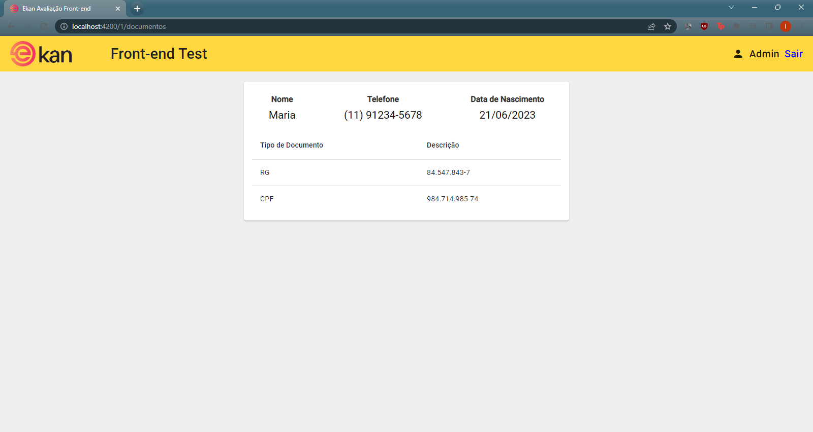

# EkanAvaliacaoFrontend

Projeto de avaliação da Ekan (Front-end)

## Descrição do Projeto

Aplicação front-end que consome a API de beneficiários para realizar a listagem, criação, atualização e remoção de beneficiários.

## Tecnologias

* Angular 16
* Angular Material
* jwt-token

## Build

Para realizar o build do projeto, é necessário ter instalado o node/npm.

Instalar o Angular CLI:

    npm install -g @angular/cli

Instalar o live-server:

    npm install -g live-server

Nas pasta do projeto, executar o seguinte comando:

    ng build

Acessar a pasta gerada:

    cd dist\ekan-avaliacao-frontend\

Rodar o comando para subir a aplicação:

    live-server --host=localhost --port=4200

Agora basta acessar http://localhost:4200 no seu browser para ver a aplicação rodando!